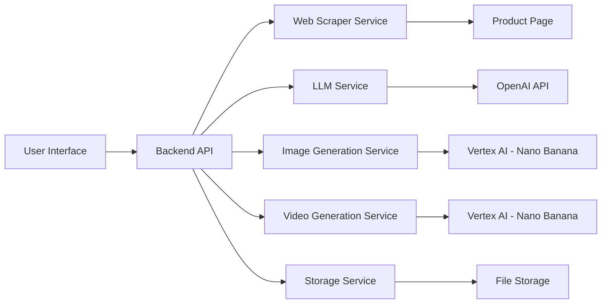

# Design Document

## Overview

The Editorial Asset Creator is a web-based application that transforms product page URLs into commercial advertising assets. The system follows a pipeline architecture: URL input → web scraping → LLM brief generation → AI asset generation → output display. The application uses a modern web stack with API integrations to OpenAI for LLM services and Google Vertex AI's Nano Banana model for image and video generation.

## Architecture

### High-Level Architecture



### Technology Stack

**Frontend:**
- React or Next.js for UI components
- TypeScript for type safety
- Tailwind CSS for styling (matching the dark theme in the mockup)
- Axios for API calls

**Backend:**
- Node.js with Express or Next.js API routes
- TypeScript
- Cheerio or Puppeteer for web scraping
- OpenAI SDK for LLM integration
- Google Cloud Vertex AI SDK for Nano Banana integration
- Axios for external API calls

**AI Services:**
- OpenAI GPT-4 for design brief generation
- Google Vertex AI with Nano Banana model for image generation
- Google Vertex AI with Nano Banana model for video generation (optional)

**Storage:**
- Local file system or cloud storage (AWS S3, Google Cloud Storage) for generated assets
- Optional: Database (PostgreSQL/MongoDB) for tracking generation history

## Components and Interfaces

### 1. Frontend Components

#### InputSection Component
```typescript
interface InputSectionProps {
  onSubmit: (url: string) => Promise<void>;
  isLoading: boolean;
}

// Renders:
// - URL input field
// - Submit button
// - Loading indicator
// - Example URL hint
```

#### OutputSection Component
```typescript
interface OutputSectionProps {
  generatedAssets: GeneratedAsset[];
  onDownload: (assetId: string) => void;
  onRegenerate: () => void;
}

interface GeneratedAsset {
  id: string;
  type: 'image' | 'video';
  url: string;
  title: string;
  description: string;
  thumbnail?: string;
}

// Renders:
// - Grid of generated assets
// - Preview cards with overlays
// - Download buttons
// - Regenerate option
```

#### DesignBriefDisplay Component
```typescript
interface DesignBriefDisplayProps {
  brief: DesignBrief;
  isVisible: boolean;
}

interface DesignBrief {
  visualStyle: string;
  messaging: string;
  targetAudience: string;
  colorPalette: string[];
  mood: string;
}

// Renders:
// - Collapsible design brief section
// - Formatted brief content
// - Edit/regenerate option
```

### 2. Backend API Endpoints

#### POST /api/generate
```typescript
interface GenerateRequest {
  productUrl: string;
  options?: {
    includeVideo: boolean;
    imageCount: number;
  };
}

interface GenerateResponse {
  jobId: string;
  status: 'processing' | 'completed' | 'failed';
  productData?: ProductData;
  designBrief?: DesignBrief;
  assets?: GeneratedAsset[];
  error?: string;
}
```

#### GET /api/status/:jobId
```typescript
interface StatusResponse {
  jobId: string;
  status: 'processing' | 'completed' | 'failed';
  progress: number; // 0-100
  currentStep: string;
  assets?: GeneratedAsset[];
  error?: string;
}
```

#### GET /api/download/:assetId
```typescript
// Returns file stream for download
// Content-Type: image/png, image/jpeg, or video/mp4
```

### 3. Service Layer

#### WebScraperService
```typescript
class WebScraperService {
  async scrapeProductPage(url: string): Promise<ProductData> {
    // Extract product name, images, description
    // Handle different e-commerce platforms
    // Return structured data
  }
}

interface ProductData {
  name: string;
  description: string;
  images: string[];
  price?: string;
  category?: string;
}
```

#### LLMService
```typescript
class LLMService {
  private openai: OpenAI;
  
  constructor() {
    this.openai = new OpenAI({ apiKey: process.env.OPENAI_API_KEY });
  }
  
  async generateDesignBrief(productData: ProductData): Promise<DesignBrief> {
    // Construct prompt with product data
    // Call OpenAI GPT-4 API
    // Parse and structure response
  }
  
  private constructPrompt(productData: ProductData): string {
    // Create detailed prompt for editorial design brief
  }
}
```

#### ImageGenerationService
```typescript
class ImageGenerationService {
  private vertexAI: VertexAI;
  
  constructor() {
    this.vertexAI = new VertexAI({
      project: process.env.GOOGLE_CLOUD_PROJECT,
      location: process.env.GOOGLE_CLOUD_REGION
    });
  }
  
  async generateImage(brief: DesignBrief, productData: ProductData): Promise<string> {
    // Construct image generation prompt from brief
    // Call Vertex AI Nano Banana API
    // Add text overlays if needed
    // Return image URL or file path
  }
}
```

#### VideoGenerationService
```typescript
class VideoGenerationService {
  private vertexAI: VertexAI;
  
  constructor() {
    this.vertexAI = new VertexAI({
      project: process.env.GOOGLE_CLOUD_PROJECT,
      location: process.env.GOOGLE_CLOUD_REGION
    });
  }
  
  async generateVideo(brief: DesignBrief, productData: ProductData): Promise<string> {
    // Construct video generation prompt from brief
    // Call Vertex AI Nano Banana API for video generation
    // Add text overlays and transitions
    // Return video URL or file path
  }
}
```

## Data Models

### ProductData
```typescript
interface ProductData {
  url: string;
  name: string;
  description: string;
  images: string[];
  price?: string;
  category?: string;
  brand?: string;
  extractedAt: Date;
}
```

### DesignBrief
```typescript
interface DesignBrief {
  productName: string;
  visualStyle: string;
  messaging: string;
  targetAudience: string;
  colorPalette: string[];
  mood: string;
  keyFeatures: string[];
  callToAction: string;
  imagePrompt: string;
  videoPrompt?: string;
  generatedAt: Date;
}
```

### GenerationJob
```typescript
interface GenerationJob {
  id: string;
  productUrl: string;
  status: 'pending' | 'scraping' | 'generating_brief' | 'generating_assets' | 'completed' | 'failed';
  productData?: ProductData;
  designBrief?: DesignBrief;
  assets: GeneratedAsset[];
  error?: string;
  createdAt: Date;
  completedAt?: Date;
}
```

### GeneratedAsset
```typescript
interface GeneratedAsset {
  id: string;
  jobId: string;
  type: 'image' | 'video';
  url: string;
  filePath: string;
  title: string;
  description: string;
  thumbnail?: string;
  metadata: {
    width?: number;
    height?: number;
    duration?: number;
    format: string;
    size: number;
  };
  createdAt: Date;
}
```

## Error Handling

### Error Types and Handling Strategy

1. **URL Validation Errors**
   - Validate URL format before processing
   - Return 400 Bad Request with clear message
   - Suggest correct URL format

2. **Web Scraping Errors**
   - Handle network timeouts (30s timeout)
   - Handle 404/403/500 responses
   - Retry logic: 3 attempts with exponential backoff
   - Fallback: Ask user to manually input product data

3. **LLM API Errors**
   - Handle rate limiting (429 responses)
   - Handle API key issues (401 responses)
   - Retry logic: 2 attempts with 5s delay
   - Fallback: Use template-based brief generation

4. **Image/Video Generation Errors**
   - Handle API failures gracefully
   - Continue with partial results (e.g., images only if video fails)
   - Provide retry option for failed assets
   - Display specific error messages per asset type

5. **Storage Errors**
   - Handle disk space issues
   - Implement cleanup for old/failed jobs
   - Provide alternative download methods

### Error Response Format
```typescript
interface ErrorResponse {
  error: {
    code: string;
    message: string;
    details?: any;
    retryable: boolean;
  };
}
```

## Testing Strategy

### Unit Tests

1. **Service Layer Tests**
   - WebScraperService: Test HTML parsing with mock pages
   - LLMService: Test prompt construction and response parsing with mocked API
   - ImageGenerationService: Test prompt generation and API integration
   - VideoGenerationService: Test prompt generation and API integration

2. **Utility Tests**
   - URL validation functions
   - Data transformation functions
   - Error handling utilities

### Integration Tests

1. **API Endpoint Tests**
   - Test /api/generate with valid URLs
   - Test /api/status polling
   - Test /api/download file streaming
   - Test error scenarios (invalid URLs, API failures)

2. **Service Integration Tests**
   - Test full pipeline: scraping → LLM → generation
   - Test with real API calls (in staging environment)
   - Test retry logic and fallbacks

### End-to-End Tests

1. **User Flow Tests**
   - Submit URL → View loading state → View results
   - Download generated assets
   - Regenerate assets
   - Handle errors gracefully

2. **Performance Tests**
   - Test with various product page structures
   - Measure generation time for images and videos
   - Test concurrent requests

### Test Data

- Mock product pages for different e-commerce platforms
- Sample product data for various categories
- Mock LLM responses
- Sample generated images/videos for UI testing

### Testing Tools

- Jest for unit and integration tests
- React Testing Library for component tests
- Playwright or Cypress for E2E tests
- MSW (Mock Service Worker) for API mocking
- Supertest for API endpoint testing

## Implementation Notes

### LLM Prompt Engineering

The design brief generation prompt should include:
- Product context (name, description, category)
- Target output format (structured JSON)
- Creative direction guidelines
- Examples of good editorial briefs
- Constraints (brand safety, appropriate content)

### Image Generation Considerations

- Use high-resolution settings (1024x1024 or higher)
- Include product images as reference if API supports it
- Add text overlays post-generation using Canvas API or image processing library
- Consider aspect ratios for different ad formats (square, landscape, portrait)

### Video Generation Considerations

- Keep videos short (5-15 seconds) for faster generation
- Use image-to-video models if available
- Add transitions and text overlays post-generation
- Provide preview thumbnails for quick loading

### Scalability Considerations

- Implement job queue (Bull, BullMQ) for handling multiple requests
- Use caching for repeated URLs
- Implement rate limiting to prevent abuse
- Consider serverless architecture for cost efficiency
- Use CDN for serving generated assets
